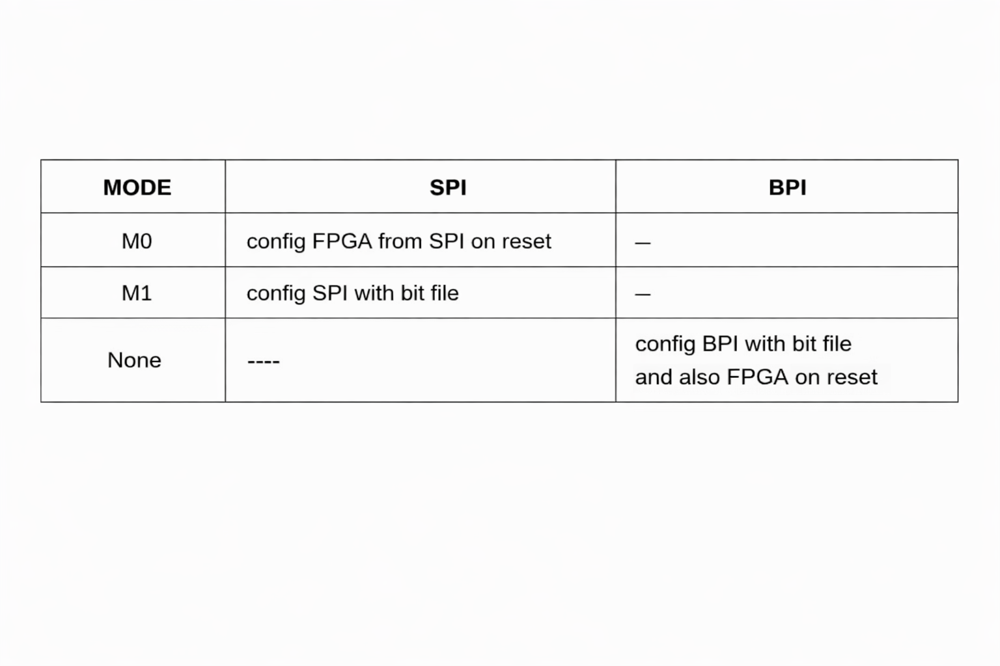

# FPGA Tests
This directory contains all the tests which successfully run on an FPGA. After 
testing hdl designs in simulation we must test it on real hardware. For Example 
after successfully running assemlby and c/cpp programs on rv32i in simulation, we 
must also test that on an FPGA. 

You can also [Download Adept](https://digilent.com/shop/software/digilent-adept/), a legacy software

In refrence manual BPI and SPI configuration is a little bit confusing. For this locate jumper J8. It has
two options M0 and M1. There are two options for non volatile memory one is BPI other is SPI. Jumper JP8 must
be at 2V5 in all cases. Dont confuse J8 with JP8.
- If you want to put your generated programming file in BPI flash, Dont select either mode for J8 i.e. remove connector from J8.
- If you want to put your generated programming file in SPI flash, select mode M1 for J8.
- If you want to configure FPGA by loading programming file from BPI flash, Dont select either mode for J8 and press BTN5 i.e. RESET.
- If you want to configure FPGA by loading programming file from SPI flash, select mode M0 for J8 and press BTN5 i.e. RESET. 

 
