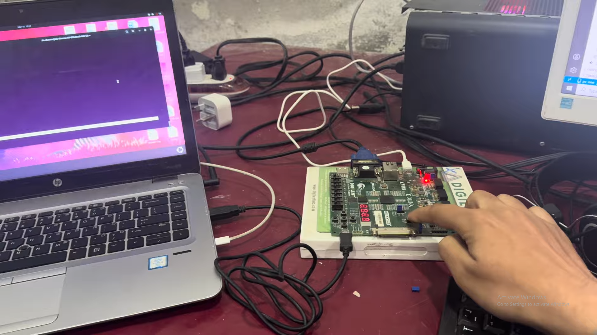

# PC-ONE

pc-one is an attempt to place the entire PC stack in one repository —  
hardware, kernel, operating system — all built from the ground up.

---

# Vision

We all have listened phrase `A computer runs on 0 and 1s`. I have spent alot
of time to uncover this completely and also did to an extent. I am making this project to
- satisfy my curiosity
- facilitate any person who wants to understand computer as a complete system
- build a reference that I wish existed when I started learning

The goal is to make a computer understandable end-to-end. 

Atleast for now the aim is to make a complete PC starting from on off electrical signals 
upto to an OS running applications. 

At the end(if that ever happens) we will have a project in which 
there will be a complete end to end design which can be directly dumped on an FPGA. For this project I am using Digilent Nexys3
but you can use any FPGA. 
Connect a mouse, a keyboard and a vga display to the FPGA and PC will be alive. The OS will be linux inspired
but very small. Just a terminal.

---

# NOTE
This branch is an educational focused contribution. It isn't an industry standard nor the most performance or silicon optimized solution. 
The default branch [`industry`](https://github.com/ZiaCheemaGit/pc-one/tree/industry) is the one you want if you want an industry viable solution. 

---

# Status

This project is under development and below is current progress
and future milestones.

## Current Progress

This is where clarity starts.Following is the progress
what has been done uptill now and what most likely 
anyone does when they make a computer.It only includes the 
completed steps. I also dont know what are the complete steps 
so I will add them here as I progress  

### MileStone 01 (Hello World over UART)

- Get a good understanding of bare metal systems. One of best resources I found was [Nand to Tetris](https://www.nand2tetris.org/).
- Make a CPU , I made a single cycle RV32I with this [ISA](https://msyksphinz-self.github.io/riscv-isadoc/#_rv32i_rv64i_instructions).
- Spend 5 days on making the CPU and 50 days on testing it , I tested using [cocotb](https://www.cocotb.org/) because watching waveforms gets boring.
- Add CI to project , [nox](https://nox.thea.codes/en/stable/) and [github actions](https://github.com/features/actions) used for this project. All tests in Dir `tests/` are ran before merge.
- Run c/cpp on cpu this is done by integrating a rom memory(compiled by riscv64-unknown-elf) with cpu.
- At this point start working on first I/O device. Core of Debugging is print statements. For this sake I decided to implement UART and see c/cpp print statements over it.       
- Learn [UART](https://digilent.com/blog/uart-explained/?srsltid=AfmBOooOWkUeD289G3AGz7XpwJ_4cPnZfhXwZAYZa62Rj4YD0beE04W1) and [Memory Mapped IO](https://www.geeksforgeeks.org/computer-organization-architecture/memory-mapped-i-o-and-isolated-i-o/) Concepts because UART cannot be added without [MMU](https://wiki.osdev.org/Memory_Management_Unit). 
- Learn about [FPGAs](https://en.wikipedia.org/wiki/Field-programmable_gate_array). Simulation testing isn't enough(Stakes are very high, even one wire if not on/off as intended can break everything).  
- First I tested c/cpp code UART prints on cocotb in simulation. When I programmed my design on FPGA it required two changes i.e division of memory in ram(data memory) and rom(instruction memory). Other thing was FPGA(nexys3) support 32 bits array memory not byte addressable memory(RISCV). UART timimg also required some changes. After all these changes my design was succesfully programmed on FPGA. But all my previously written simulation cocotb tests started failing. All tests had to be re-written. Even  after that c/cpp terminal prints didn't work on FPGA. In short what works in simulation doesn't always work on hardware. Its best to run your design on hardware in parallel to development.
- At last UART works and I can see c/cpp prints on a physical terminal i.e [minicom](https://linux.die.net/man/1/minicom). Problem was that in cocotb clock frequency can be simulated to be anything and design will be simulated regradless of clk frequency but on FPGA a single cycle rv32i cannot run above the time required by the longest instruction. Here is a [demo video](https://youtu.be/YHuOQX06mLM?si=AHQMabuc4YgpbC6A).
[](https://youtu.be/YHuOQX06mLM?si=AHQMabuc4YgpbC6A)

### Milestone 02 (Boot over UART)

- At this point I am a bit lost and confused. Can't decide between `cpu traps` and `VGA` or maybe I should entirely do something else. Here is some [advice](https://forum.osdev.org/viewtopic.php?t=58078) I got from OSDev Community which is actually worth alot because from there I got introduced to concept of DMA and booting over UART to skip hassle of FPGA Re-configuration when changes are software only. After that VGA can be completed.
- For this milestone I decided to implement VGA. It has heavy software dependency, just to show a blank white screen I had to repeat `edit c files --> reconfig FPGA(8 mins per bitgen file) --> test`. Thus I changed milestone02 to Add boot capability over UART.  
- Learn about BIOS, bootloader, OS , their responsibilities and how these three load and execute. This is crucial to support booting over UART. See this [video](https://youtu.be/XpFsMB6FoOs?si=iKalRxdDKPQcJu4N)
- Implement UART rx. Also, this a good point for a cleanup and optimizations. After uart rx implementation I analyzed ISE console all warnings, how it synthesized design, which parts took longer and after fixing these and doing some memory optimizations I was able to bring `bitgen time` from `8 minutes` to `3 minutes`. Also reduced LUT usage from `5400/9112(total LUTs)` to `3550/9112`. Currently ram read is combinational rather than synchronus to support data read in same cycle, when cpu requests data becasue cpu is single cycle. Thus, this ram maps to memory as LUTs. This ram, if made synchronus, will map to BRAM. This can further decrease LUT usage. But then CPU must be pipelined as data will be available one cycle after it is requested.
- Another very important thing is program(i.e. bootloader) loaded via UART will be downloaded into ram and then execute that. UART bootloader aside, In future any program will end up loading in ram for execution. A single port ram cannot support instruction-fetch and data-write in same cycle. This is another very strong reason for cpu to be made pipelined.  
- Now understand [pipelining](https://en.wikipedia.org/wiki/Instruction_pipelining) concept and what problems it solve. How it solve synchronus read, increase maximum frequency at which CPU can run e.t.c. For a high level view see this [video](https://youtu.be/1U4v_2J0Qwk?si=WOSo4rIQH2Y1EOng). After that you can see this [video](https://youtu.be/iL37v8Nlqvk?si=XeIj54lR8vLJZEaH) for a deeper insight.
- Single cycle RV32I occupied `2300 LUTs`.
-
- TODO  

## Next Milestones:
This is what is currently being tried to be done.
- pipeline cpu
- Add DMA
- implement cpu traps
- Add VGA
---

# Getting Started
Clone and explore:
```sh
git clone https://github.com/ZiaCheemaGit/pc-one.git
```
In all directories and sub directories there is a `README.md`. These readme files hopefully will 
help anyone at the beginning to get a fair amount of clarity. After getting an overview through 
these one can dive into source code.

---

# Project Structure
```text
.
├── FPGA
│   ├── README.md
│   └── digilent_nexys3
│       ├── README.md
│       ├── demo_lab.pdf
│       ├── nexys3_refrence_manual.pdf
│       └── top_nexys3.ucf
├── LICENSE
├── README.md
├── __pycache__
│   └── noxfile.cpython-312.pyc
├── hardware
│   ├── FPGA_digilent_nexys3
│   │   ├── cellular_ram_controller.v
│   │   └── top_nexys3.v
│   ├── MMU
│   │   ├── MMU.v
│   │   └── README.md
│   ├── README.md
│   ├── UART
│   │   ├── README.md
│   │   ├── uart_rx.v
│   │   └── uart_tx.v
│   ├── VGA
│   │   ├── pattern.py
│   │   ├── vga_controller.v
│   │   └── vram.v
│   ├── memories
│   │   ├── README.md
│   │   ├── boot_rom.v
│   │   └── ram.v
│   ├── pc_one
│   │   ├── README.md
│   │   └── pc_one.v
│   └── processors
│       ├── README.md
│       ├── five_stage_pipelined_rv32i_core
│       │   ├── README.md
│       │   └── five_stage_pipelined_rv32i_core.v
│       ├── lib
│       │   ├── adder32.v
│       │   ├── alu_control.v
│       │   ├── control_unit.v
│       │   ├── load_op.v
│       │   ├── main_alu.v
│       │   ├── mux_4X1.v
│       │   ├── mux_5X1.v
│       │   ├── pc.v
│       │   ├── pc_src_control.v
│       │   ├── register_file.v
│       │   └── sign_ext_12_to_32.v
│       └── single_cycle_rv32i_core
│           ├── README.md
│           └── single_cycle_rv32i_core.v
├── images
│   ├── FPGA_digilent_nexys3
│   │   └── config_table.png
│   ├── README.md
│   ├── hardware
│   │   ├── MMU.png
│   │   └── Makefile
│   └── youtube
│       └── M1.png
├── noxfile.py
├── python_helper
│   ├── README.md
│   ├── __init__.py
│   ├── __pycache__
│   │   ├── __init__.cpython-312-pytest-9.0.2.pyc
│   │   ├── converter.cpython-312-pytest-9.0.2.pyc
│   │   ├── instructions.cpython-312-pytest-9.0.2.pyc
│   │   ├── logging.cpython-312-pytest-9.0.2.pyc
│   │   └── uart_terminal.cpython-312-pytest-9.0.2.pyc
│   ├── bin2hex32.py
│   ├── converter.py
│   ├── instructions.py
│   ├── logging.py
│   ├── uart_terminal.py
│   └── vga.py
├── software
│   ├── BIOS
│   │   ├── bios.c
│   │   ├── crt0.S
│   │   └── link.ld
│   ├── Makefile
│   ├── README.md
│   ├── bootloader
│   ├── build
│   │   └── BIOS
│   │       ├── bios.bin
│   │       ├── bios.dump
│   │       ├── bios.elf
│   │       └── bios.hex
│   ├── drivers
│   │   ├── uart.c
│   │   └── vga.c
│   ├── include
│   │   ├── bios.h
│   │   ├── tests.h
│   │   ├── time.h
│   │   ├── uart.h
│   │   └── vga.h
│   ├── kernel
│   │   └── main.c
│   ├── lib
│   │   └── time.c
│   └── tests
│       └── test_1.c
└── tests
    ├── README.md
    ├── hardware
    │   ├── FPGA_digilent_nexys3
    │   │   ├── Makefile
    │   │   ├── README.md
    │   │   ├── __pycache__
    │   │   │   └── test.cpython-312-pytest-9.0.2.pyc
    │   │   ├── build.log
    │   │   ├── results.xml
    │   │   ├── sim_build
    │   │   │   ├── cmds.f
    │   │   │   └── sim.vvp
    │   │   ├── simulation_uart_terminal_display.log
    │   │   └── test.py
    │   ├── pc_one
    │   │   ├── Makefile
    │   │   ├── README.md
    │   │   ├── __pycache__
    │   │   │   └── test.cpython-312-pytest-9.0.2.pyc
    │   │   ├── results.xml
    │   │   ├── sim_build
    │   │   │   ├── cmds.f
    │   │   │   └── sim.vvp
    │   │   ├── simulation_test_basic_asm.log
    │   │   ├── simulation_test_load_asm.log
    │   │   ├── simulation_test_math_c.log
    │   │   ├── test.py
    │   │   └── test_cases
    │   │       ├── Makefile
    │   │       ├── asm_tests
    │   │       │   ├── test_basic_asm.s
    │   │       │   └── test_load_asm.s
    │   │       ├── c-cpp_tests
    │   │       │   └── test_math_c.c
    │   │       └── generated_hex
    │   │           ├── asm_tests_test_basic_asm
    │   │           │   ├── test_basic_asm.bin
    │   │           │   ├── test_basic_asm.dump
    │   │           │   ├── test_basic_asm.elf
    │   │           │   └── test_basic_asm.hex
    │   │           ├── asm_tests_test_load_asm
    │   │           │   ├── test_load_asm.bin
    │   │           │   ├── test_load_asm.dump
    │   │           │   ├── test_load_asm.elf
    │   │           │   └── test_load_asm.hex
    │   │           └── c-cpp_tests_test_math_c
    │   │               ├── test_math_c.bin
    │   │               ├── test_math_c.dump
    │   │               ├── test_math_c.elf
    │   │               └── test_math_c.hex
    │   └── processors
    │       ├── five_stage_pipelined_rv32i_core
    │       │   ├── Makefile
    │       │   ├── __pycache__
    │       │   │   └── test.cpython-312-pytest-9.0.2.pyc
    │       │   ├── results.xml
    │       │   ├── sim_build
    │       │   │   ├── cmds.f
    │       │   │   └── sim.vvp
    │       │   └── test.py
    │       └── single_cycle_rv32i_core
    │           ├── Makefile
    │           ├── __pycache__
    │           │   └── test_core.cpython-312-pytest-9.0.2.pyc
    │           ├── results.xml
    │           ├── sim_build
    │           │   ├── cmds.f
    │           │   └── sim.vvp
    │           └── test_core.py
    └── software
        ├── BIOS
        │   ├── bios.c
        │   ├── crt0.S
        │   └── link.ld
        ├── Makefile
        ├── README.md
        ├── bootloader
        ├── build
        │   └── BIOS
        │       ├── bios.bin
        │       ├── bios.dump
        │       ├── bios.elf
        │       └── bios.hex
        ├── drivers
        │   ├── uart.c
        │   └── vga.c
        ├── include
        │   ├── bios.h
        │   ├── tests.h
        │   ├── time.h
        │   ├── uart.h
        │   └── vga.h
        ├── kernel
        │   └── main.c
        ├── lib
        │   └── time.c
        └── tests
            └── test_1.c
```

---

# Contributing

This is definitely a huge project. Pull requests, ideas, and corrections are welcome from anyone who shares the vision.


