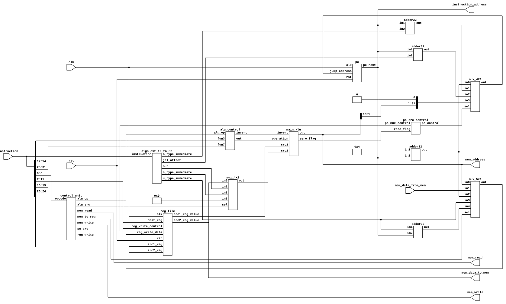

# Hardware
This directory contains all the hardware design files. All the files are in verilog 
and in each sub directory there is one verilog file per module. This is to ensure simplicity
and clarity.

## Single Cycle RV32I Core
CPU is the most basic part of any computer. For this project an RV32I is built based on 
the [ISA](https://msyksphinz-self.github.io/riscv-isadoc/#_rv32i_rv64i_instructions) provided by RISCV. This choice is a good balance between simplicity and functionality. It is minimal enough to be easy to understand and implement, while still
being powerful enough to execute meaningful programs.

